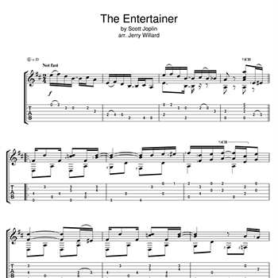
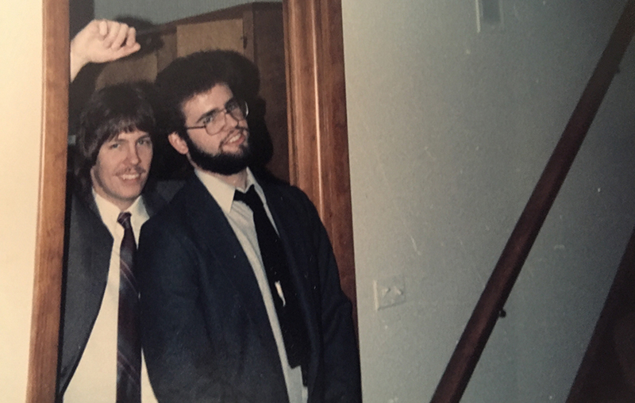

# Bass Deaf Website Design Tutorial

This tutorial documents the complete design process and styling decisions for the Bass Deaf website, including color palette implementation, layout improvements, and semantic HTML structure.

## Table of Contents
1. [Color Palette Implementation](#color-palette-implementation)
2. [Semantic HTML Improvements](#semantic-html-improvements)
3. [Feature Card Design](#feature-card-design)
4. [Hero Section & Content Overlap](#hero-section--content-overlap)
5. [Hero Title Redesign](#hero-title-redesign)
6. [Drop Shadows & Dimension](#drop-shadows--dimension)
7. [Layout Spacing & Padding](#layout-spacing--padding)
8. [Responsive Desktop Margins](#responsive-desktop-7. **Progressive desktop margins** - Optimized content width for readability
8. **Modern image layout** - Images between paragraphs for responsive storytellingargins)
9. [Footer Implementation](#footer-implementation)
10. [Modern Image Layout for Subpages](#modern-image-layout-for-subpages)
11. [Final Results](#final-results)

---

## Color Palette Implementation

### Primary Color Selection
- **Primary Purple:** `#4d1979` - Used for navigation, headers, and primary elements
- **Background:** `#f8f6fb` - Light purple-tinted background for body
- **Feature Cards:** Purple gradient - Creates cohesive brand experience (Option 3)
- **Gallery Cards:** Light purple gradient - Subtle depth and visual interest
- **Text Colors:** `#2c3e50` - Dark blue-gray for readability

### Color Palette Options Considered
1. **Option 1:** Complementary orange (`#e67e22`)
2. **Option 2:** Teal accent (`#16a085`) 
3. **Option 3:** Gradient purple cards ✅ *Selected*

### Implementation Details
```css
/* Body background */
body {
    background-color: #f8f6fb;
}

/* Feature cards - Purple gradient */
.features div { 
    background: linear-gradient(135deg, #4d1979 0%, #6a2c91 50%, #8b3fab 100%);
    color: white; 
}

/* Feature cards hover - Darker purple gradient */
.feature-link:hover div {
    background: linear-gradient(135deg, #3d1461 0%, #5a2379 50%, #7a3093 100%);
}

/* Essay text section */
.essay-text { 
    background-color: #ffffff; 
    color: #2c3e50; 
    border: 1px solid #f1eef6;
}

/* Gallery cards - Light purple gradient */
.gallery div { 
    background: linear-gradient(135deg, #f1eef6 0%, #e8e1f0 50%, #ddd4ea 100%);
}
```

---

## Semantic HTML Improvements

### Heading Hierarchy Fix
**Problem:** Feature cards used `h3` tags, skipping `h2` level
**Solution:** Changed all feature headings from `h3` to `h2`

**Before:**
```html
<h1>Bass Deaf</h1> <!-- Main title -->
<h3>Jazz & Understanding</h3> <!-- Skipped h2 -->
```

**After:**
```html
<h1>Bass Deaf</h1> <!-- Main title -->
<h2>Jazz & Understanding</h2> <!-- Proper hierarchy -->
```

### Benefits
- ✅ Better accessibility for screen readers
- ✅ Improved SEO structure
- ✅ Semantic correctness
- ✅ Proper content hierarchy

---

## Feature Card Design

### Content Simplification
**Removed essay snippets** from feature boxes to create cleaner navigation cards

**Before:**
```html
<div>
    
    <h2>Jazz & Understanding</h2>
    <p>How jazz began to make more sense after Todd's death...</p>
</div>
```

**After:**
```html
<div>
    
    <h2>Jazz & Understanding</h2>
</div>
```

### Typography Spacing
Added margin to feature headings for better visual separation:
```css
.features h2 {
    margin-top: 15px;
}
```

---

## Hero Section & Content Overlap

### Content Restructuring
**Moved title and subtitle from hero graphic to essay text box** for better accessibility and readability.

### Hero Section Cleanup
```css
.hero { 
    background-image: url('images/squire.jpg');
    background-size: cover;
    background-position: center;
    height: 70vh;
    /* Removed text elements */
}
```

### Essay Text Overlap Effect
```css
.essay-text { 
    margin-top: -60px;        /* Creates overlap */
    position: relative;
    z-index: 2;              /* Sits above hero */
    box-shadow: 0 4px 12px rgba(0, 0, 0, 0.15);
    border-radius: 8px;
    margin-left: 20px;
    margin-right: 20px;
}
```

### New Header Structure
```html
<div class="essay-text">
    <header class="essay-header">
        <h1>Bass Deaf</h1>
        <p class="subtitle">An essay about music, family, and finding one's place in the larger song</p>
    </header>
    <p>The bright November Sunday...</p>
</div>
```

### Header Styling
```css
.essay-header {
    border-bottom: 2px solid #4d1979;
    margin-bottom: 25px;
    padding-bottom: 20px;
}

.essay-header h1 {
    color: #4d1979;           /* Primary purple */
    font-size: 2.5em;
    margin-bottom: 10px;
    line-height: 1.2;
}

.essay-header .subtitle {
    color: #16a085;           /* Teal accent */
    font-size: 1.2em;
    font-style: italic;
    margin: 0;
    line-height: 1.4;
}
```

---

## Hero Title Redesign

### Design Evolution
After initial implementation with title in essay text, redesigned for maximum visual impact by moving the main title back to hero as a dramatic overlay while keeping subtitle in content area.

### Problem Statement
The title in the essay text box, while semantically correct, lacked the visual drama and impact needed for an engaging landing page experience.

### Solution: Large Hero Title Overlay
Created a bold, centered title overlay on the hero image with dramatically increased size and enhanced readability features.

### HTML Structure Changes
```html
<!-- Before: Title in essay text -->
<div class="hero"></div>
<div class="essay-text">
    <header class="essay-header">
        <h1>Bass Deaf</h1>
        <p class="subtitle">An essay about music, family...</p>
    </header>
</div>

<!-- After: Title on hero, subtitle in essay -->
<div class="hero">
    <h1>Bass Deaf</h1>
</div>
<div class="essay-text">
    <header class="essay-header">
        <p class="subtitle">An essay about music, family...</p>
    </header>
</div>
```

### Hero Layout Updates
```css
.hero { 
    background-image: 
        linear-gradient(to right, rgba(0, 0, 0, 0.4), rgba(0, 0, 0, 0.4)),
        url('images/rode_swags_early_studio.jpg');
    display: flex;
    flex-direction: column;
    justify-content: center;
    align-items: center;        /* Changed from flex-end to center */
    padding: 40px;              /* Changed from padding-right only */
}
```

### Dramatic Title Styling
```css
.hero h1 {
    font-size: 5em;                              /* Mobile base size */
    color: white;
    text-shadow: 2px 2px 4px rgba(0, 0, 0, 0.7); /* Enhanced readability */
    font-weight: bold;                           /* Maximum impact */
    text-align: center;
    position: relative;
    z-index: 1;
}

/* Responsive scaling */
@media (min-width: 768px) {
    .hero h1 {
        font-size: 7em;          /* Even larger on desktop */
    }
}
```

### Subtitle Refinements
```css
.essay-header .subtitle {
    color: #16a085;          /* Teal accent color */
    font-size: 1.4em;        /* Increased from 1.2em */
    font-style: italic;
    text-align: center;      /* Centered for balance */
    margin: 0;
    line-height: 1.4;
}
```

### Visual Impact Improvements
**Background Overlay:**
- **Even gradient:** Changed from right-fade to consistent 40% opacity
- **Better contrast:** Ensures title readability across entire image

**Typography Hierarchy:**
- **Massive scale:** 5em mobile → 7em desktop creates commanding presence
- **Bold weight:** Maximum visual impact without losing elegance
- **Professional shadows:** Subtle but effective readability enhancement

### Benefits Achieved
**Visual Impact:**
- ✅ **Dramatic first impression** - Large title dominates hero space
- ✅ **Clear hierarchy** - Title for impact, subtitle for context
- ✅ **Professional appearance** - Bold typography with refined details

**User Experience:**
- ✅ **Immediate recognition** - Site purpose clear at first glance
- ✅ **Balanced layout** - Title on hero, subtitle in content creates flow
- ✅ **Responsive scaling** - Grows appropriately on larger screens

**Design Cohesion:**
- ✅ **Color consistency** - Uses established teal accent for subtitle
- ✅ **Maintained accessibility** - Proper heading hierarchy preserved
- ✅ **Enhanced readability** - Text shadow and gradient optimization

---

## Drop Shadows & Dimension

### Shadow Implementation
Added dramatic drop shadows to create depth and visual interest.

### Base State Shadows
```css
.features div { 
    box-shadow: 0 4px 12px rgba(0, 0, 0, 0.35);
}

.gallery div { 
    box-shadow: 0 4px 12px rgba(0, 0, 0, 0.35);
    transition: all 0.3s ease;
}
```

### Enhanced Hover Effects
```css
.feature-link:hover div {
    transform: translateY(-2px);
    background-color: #138d75;     /* Darker teal */
    box-shadow: 0 8px 25px rgba(0, 0, 0, 0.45);
}

.gallery div:hover {
    transform: translateY(-2px);
    box-shadow: 0 8px 25px rgba(0, 0, 0, 0.45);
}
```

### Shadow Intensity Progression
1. **Initial:** `rgba(0, 0, 0, 0.2)` - Subtle
2. **Moderate:** `rgba(0, 0, 0, 0.35)` - More pronounced
3. **Enhanced:** `rgba(0, 0, 0, 0.45)` - Dramatic hover effect

---

## Layout Spacing & Padding

### Features Section Padding
Added comprehensive padding for better visual separation:
```css
.features {
    padding: 30px 20px;    /* Vertical and horizontal spacing */
}
```

### Benefits
- **Top spacing:** Separation from essay text
- **Bottom spacing:** Separation from gallery
- **Side margins:** Prevents edge-to-edge on mobile
- **Visual hierarchy:** Distinct content sections

---

## Responsive Desktop Margins

### Problem Statement
On larger desktop screens, content stretched full-width created poor readability and unprofessional appearance with overly long line lengths.

### Solution: Percentage-Based Responsive Margins
Implemented progressive margin scaling that grows with screen size for optimal reading experience.

### Implementation Options Considered
1. **Option 1:** Percentage-based responsive margins ✅ *Selected*
2. **Option 2:** Max-width container approach
3. **Option 3:** Fixed pixel margins

### Responsive Margin Implementation
```css
/* Tablet/Desktop (768px+) */
@media (min-width: 768px) {
    .essay-text {
        margin-left: 10%;
        margin-right: 10%;
    }
    
    .features {
        padding-left: 10%;
        padding-right: 10%;
    }
}

/* Large Desktop (1200px+) */
@media (min-width: 1200px) {
    .essay-text {
        margin-left: 15%;
        margin-right: 15%;
    }
    
    .features {
        padding-left: 15%;
        padding-right: 15%;
    }
}
```

### Benefits Achieved
**Readability Improvements:**
- ✅ **Optimal line length** - Prevents overly long lines on wide screens
- ✅ **Better focus** - Content feels more contained and easier to scan
- ✅ **Professional proportions** - Matches modern web design standards

**Visual Appeal:**
- ✅ **Enhanced floating effect** - Essay text card appears more prominent
- ✅ **Better typography hierarchy** - Content feels more intentional
- ✅ **Responsive scaling** - Margins grow appropriately with screen size

**Layout Harmony:**
- ✅ **Consistent spacing** - Both essay and features sections scale together
- ✅ **Mobile-first approach** - Preserves tight margins for smaller screens
- ✅ **Progressive enhancement** - Improves experience as screen size increases

---

## Modern Image Layout for Subpages

### Problem Statement
Initial subpage design used CSS floats and complex grid layouts for image/text combinations, which created responsive issues and poor mobile experience. Float-based layouts required manual clearing, had awkward text wrapping, and were difficult to maintain across different screen sizes.

### Design Challenge
How to effectively place and size images within content pages to:
- Support the narrative flow
- Work responsively across all devices
- Maintain accessibility and semantic markup
- Provide visual interest without disrupting readability

### Solution Evolution

#### Phase 1: Float-Based Layout (Deprecated)
**Initial approach** used CSS floats for image/text combinations:
```css
/* DEPRECATED - Float approach */
.content-image-float-left {
  float: left;
  max-width: 250px;
  margin: 0 20px 20px 0;
}
```

**Problems identified:**
- ❌ Required manual clearing with `clear: both`
- ❌ Awkward responsive behavior on mobile
- ❌ Text wrapping issues
- ❌ Accessibility concerns with content flow
- ❌ Complex maintenance

#### Phase 2: CSS Grid Layout (Overly Complex)
**Attempted solution** with CSS Grid for side-by-side layouts:
```css
/* DEPRECATED - Grid approach */
.content-section-image-left {
  display: grid;
  grid-template-columns: 200px 1fr;
  gap: 20px;
  align-items: start;
}
```

**Problems identified:**
- ❌ Still not truly responsive
- ❌ Complex media query management
- ❌ Inconsistent behavior across devices
- ❌ Over-engineered for content needs

#### Phase 3: Images Between Paragraphs (Final Solution)
**Modern approach** places images as natural breaks between content sections:

### Implementation: Images Between Paragraphs

#### HTML Structure
```html
<!-- Clean, semantic markup -->
<main>
    <h1>Playing Together</h1>
    
    <!-- Featured hero image -->
    <figure>
        
    </figure>
    
    <p>Todd was encouraging initially...</p>
    
    <!-- Contextual image between paragraphs -->
    <figure>
        
        <figcaption>Proper hand positioning is essential for collaborative playing</figcaption>
    </figure>
    
    <p>He also showed me the proper hand position...</p>
</main>
```

#### CSS Implementation
```css
/* Simple, responsive image classes */
.content-image-small {
  max-width: 300px;
  width: 100%;
  height: auto;
  border-radius: 5px;
  box-shadow: 0 4px 12px rgba(0, 0, 0, 0.15);
  margin: 30px auto;
  display: block;
}

.content-image-medium {
  max-width: 500px;
  width: 100%;
  height: auto;
  border-radius: 5px;
  box-shadow: 0 4px 12px rgba(0, 0, 0, 0.15);
  margin: 30px auto;
  display: block;
}

.content-image-large {
  max-width: 700px;
  width: 100%;
  height: auto;
  border-radius: 5px;
  box-shadow: 0 4px 12px rgba(0, 0, 0, 0.15);
  margin: 30px auto;
  display: block;
}

/* Semantic figure styling */
figure {
  margin: 30px 0;
  text-align: center;
}

figcaption {
  font-size: 0.9em;
  color: #666;
  font-style: italic;
  margin-top: 10px;
  line-height: 1.4;
}
```

#### Responsive Scaling
```css
/* Mobile optimization */
@media (max-width: 480px) {
    .content-image-small {
        max-width: 250px;
        margin: 20px auto;
    }
    
    .content-image-medium,
    .content-image-large {
        max-width: 100%;
        margin: 20px auto;
    }
    
    figure {
        margin: 20px 0;
    }
    
    figcaption {
        font-size: 0.8em;
        padding: 0 10px;
    }
}

/* Desktop scaling */
@media (min-width: 1200px) {
    .content-image-small {
        max-width: 400px;
    }
    
    .content-image-medium {
        max-width: 600px;
    }
    
    .content-image-large {
        max-width: 800px;
    }
}
```

### Benefits of Images Between Paragraphs

#### User Experience
- ✅ **Natural reading flow** - Images serve as visual breaks
- ✅ **Intuitive navigation** - Content flows top to bottom
- ✅ **Better storytelling** - Images support narrative at logical points
- ✅ **Mobile-first design** - Works perfectly on all screen sizes

#### Technical Advantages
- ✅ **True responsiveness** - Images scale naturally with containers
- ✅ **Semantic HTML** - Proper `<figure>` and `<figcaption>` structure
- ✅ **Accessibility** - Screen readers follow logical content order
- ✅ **Maintainable code** - Simple CSS classes, no complex layouts
- ✅ **Performance** - No layout recalculation issues

#### Design Consistency
- ✅ **Visual hierarchy** - Clear size relationships (small/medium/large)
- ✅ **Consistent spacing** - Uniform margins create rhythm
- ✅ **Professional appearance** - Clean, magazine-style layout
- ✅ **Cohesive styling** - Matches existing shadow and border-radius system

### Content Strategy for Image Placement

#### Image Size Guidelines
- **`.content-image-large`** - Hero images, main illustrations
- **`.content-image-medium`** - Supporting visuals, technique demonstrations
- **`.content-image-small`** - Secondary images, album covers, portraits

#### Placement Strategy
1. **Opening image** - Sets visual context for the article
2. **Technique images** - Support instructional content
3. **Contextual images** - Reinforce narrative points
4. **Gallery sections** - Multiple related images using thumbnail grid

#### Caption Best Practices
- **Descriptive** - Explain what the image shows
- **Contextual** - Connect to surrounding content
- **Accessible** - Support screen reader users
- **Concise** - Brief but informative

### Results: Playing Together Page Example

The refactored "Playing Together" page demonstrates:
- **Hero image** establishes collaboration theme
- **Hand position image** supports technique discussion
- **Squire bass image** reinforces narrative about equipment
- **Mystery Dates image** connects to band story
- **Thumbnail gallery** showcases collaboration concepts

### Technical Implementation Notes

#### Removed Deprecated CSS
Cleaned up CSS by removing:
- All float-based image classes
- Complex grid section layouts
- Responsive overrides for grid systems
- Manual clearing requirements

#### Simplified Media Queries
Reduced from complex grid management to simple image scaling:
```css
/* Before: Complex grid responsive rules */
.content-section-image-left {
    grid-template-columns: 1fr;
    gap: 15px;
}

/* After: Simple image scaling */
.content-image-medium {
    max-width: 100%;
}
```

### Future Enhancement Opportunities
- **Lazy loading** - Add `loading="lazy"` for performance
- **Image optimization** - WebP format with fallbacks
- **Caption animations** - Subtle fade-in effects
- **Gallery lightbox** - Click to expand functionality
- **Print styles** - Optimized sizing for print media

---

## Footer Implementation

### Footer Structure
```html
<footer class="footer">
    <p>&copy; 2025 Bass Deaf. An essay about music, family, and finding one's place in the larger song.</p>
</footer>
```

### Footer Styling
```css
.footer {
    background-color: #4d1979;    /* Primary purple */
    color: white;
    text-align: center;
    padding: 30px 20px;
    margin-top: 20px;
    border-radius: 5px;
}

.footer p {
    margin: 0;
    font-size: 1em;
    line-height: 1.4;
}
```

---

## Final Results

### Color Scheme Summary
- **Primary:** #4d1979 (Rich Purple)
- **Feature Cards:** Purple gradient (#4d1979 → #6a2c91 → #8b3fab)
- **Gallery Cards:** Light purple gradient (#f1eef6 → #e8e1f0 → #ddd4ea)
- **Background:** #f8f6fb (Light Purple Tint)
- **Content:** #ffffff (Pure White)
- **Text:** #2c3e50 (Dark Blue-Gray)

### Key Design Features
1. **Overlapping content card** - Essay text floats over hero image
2. **Dramatic hero title overlay** - Large, bold title dominates hero space
3. **Dramatic drop shadows** - Cards have strong dimensional effects
4. **Clean feature navigation** - Image + title only for focused UX
5. **Proper semantic structure** - Accessible heading hierarchy
6. **Cohesive color palette** - Purple gradient scheme creates unified brand experience
7. **Responsive spacing** - Proper padding and margins throughout
8. **Progressive desktop margins** - Optimized content width for readability

### Accessibility Improvements
- ✅ Proper heading hierarchy (h1 → h2)
- ✅ Semantic HTML structure
- ✅ High contrast text on backgrounds
- ✅ Readable typography sizing
- ✅ Clear visual hierarchy

### Modern Design Elements
- ✅ Floating/overlapping content cards
- ✅ Dramatic hero title overlay with responsive scaling
- ✅ Dramatic drop shadows with hover effects
- ✅ Clean, minimalist feature cards
- ✅ Sophisticated color palette
- ✅ Professional typography treatment

---

## Implementation Notes

### CSS Organization
- Mobile-first responsive design
- Consistent use of CSS custom properties could be added
- Proper cascade and specificity management
- Smooth transitions for interactive elements

### Future Enhancements
- Consider CSS custom properties for color management
- Add focus states for keyboard navigation
- Implement CSS Grid container queries for advanced responsive design
- Add animation keyframes for more sophisticated hover effects
- Explore fluid typography using clamp() for even better responsive scaling
- Add lazy loading and WebP image optimization for subpage images
- Implement gallery lightbox functionality for image collections

---

*Tutorial completed: All design decisions documented for the Bass Deaf website transformation from basic layout to modern, accessible, and visually compelling design with dramatic hero title overlay, optimized desktop readability, and responsive image storytelling for subpages.*
